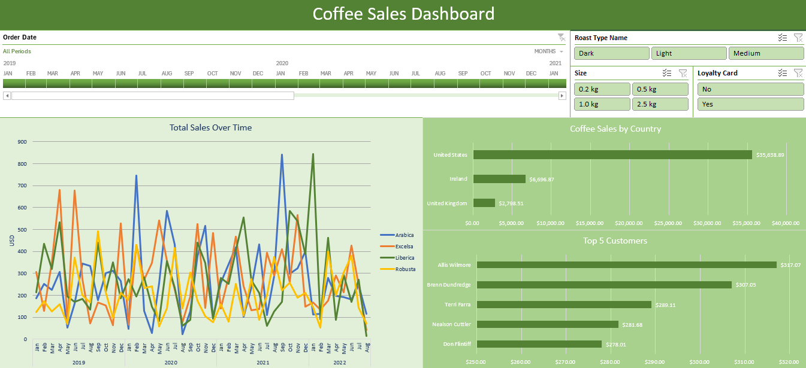

# Coffee Sales Report Dashboard

This project is an interactive **Excel dashboard** built to analyze coffee sales data.  
It was created as a learning project by following this tutorial:  
➡️ [Excel Dashboard Tutorial | Beginner Friendly](https://www.youtube.com/watch?v=m13o5aqeCbM)  

## 📊 Project Overview
The Coffee Sales Dashboard provides insights into:
- Sales performance across different countries  
- Trends over time (monthly/quarterly sales)  
- Product-level performance (types of coffee, sizes, etc.)  
- Key metrics summarized with charts and pivot tables  

## 🛠️ Skills Demonstrated
- Data cleaning and preparation in Excel  
- Using **PivotTables** and **PivotCharts**  
- Building an interactive **dashboard** with slicers and filters  
- Applying professional formatting for readability and presentation  

## 🔗 Acknowledgment
This dashboard was created as a learning project by following tutorials from  
➡️ [Mo Chen on YouTube](https://www.youtube.com/@mo-chen)  
